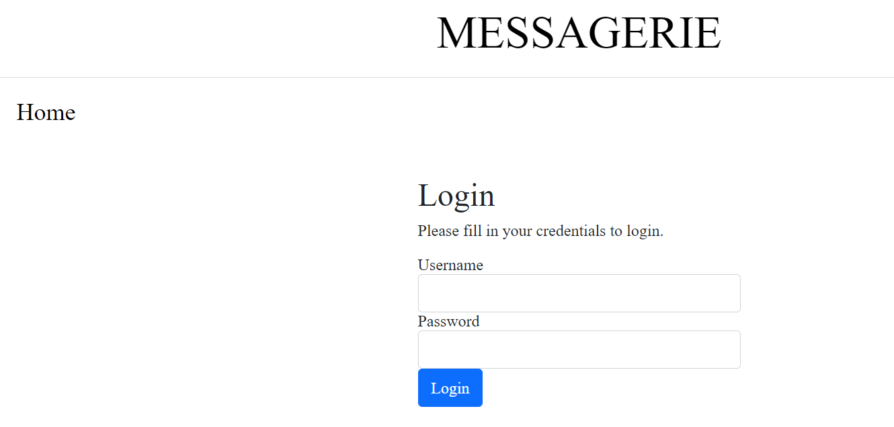
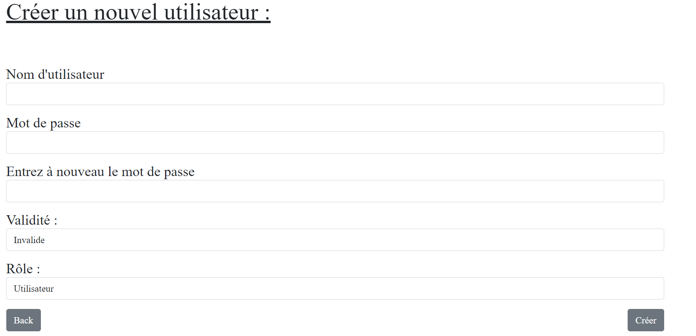
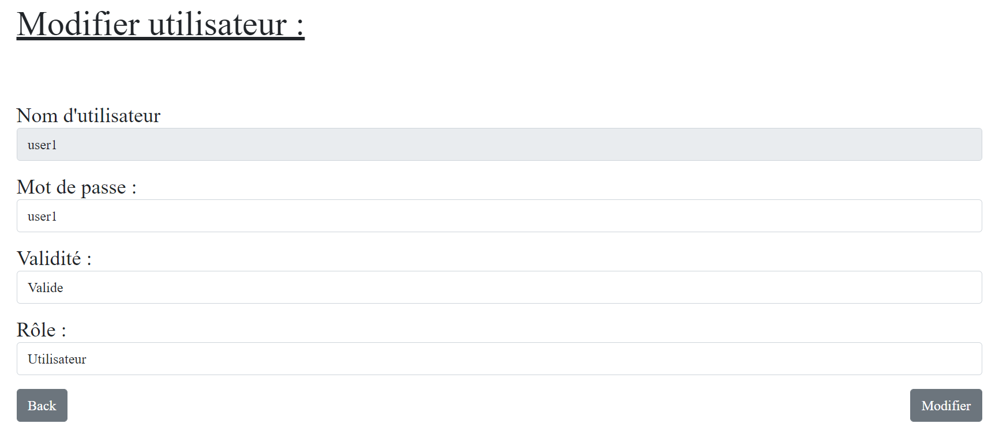
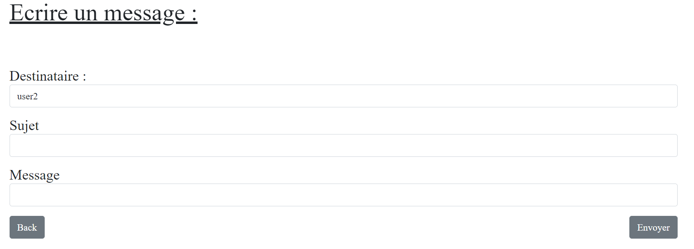

# Manuel d'utilisation

Auteurs : Peguiron Adrien, Viotti Nicolas

## Manuel administrateur

### Mise en place

Pour commencer, clonez ce repo en local. 

Exécutez ensuite le script `setup.sh`. Ce dernier sert à mettre en place le container docker avec tout ce dont il a besoin pour la bonne exécution du site. Les différentes étapes de la mise en place du container sont décrites plus en détail dans les commentaires du script.

**<u>Si le script retourne une erreur essayez de le relancer.</u>** 

Une fois l’exécution terminée, le site est accessible à l’adresse 127.0.0.1:8080 (si vous avez choisi d'utiliser un autre port, remplacez le 8080 par celui-ci.)

Vous arrivez ensuite sur la page de login suivante : 

### Manuel Administrateur

Le compte administrateur est `admin` avec comme mot de passe `admin`. 

Une fois les credentials entrés, vous arrivez sur la page principale du site : 


Un administrateur peut effectuer les mêmes opérations qu’un utilisateur lambda en plus de ses privilèges d’administrateur. Dans cette partie du manuel, seules les opérations disponibles uniquement aux administrateurs seront abordées. Si vous souhaitez vous renseigner sur celles disponibles pour tous, veuillez vous référer à la section suivante : `Manuel Utilisateur`.

Les fonctionnalités uniques aux administrateurs sont les suivantes : ajouter, supprimer ou modifier un utilisateur. 

### Créer un nouvel utilisateur

Pour ajouter un utilisateur, cliquez sur le bouton `Créer un nouvel utilisateur`. 

La page suivante s'ouvre : 



Les champ `nom d'utilisateur` et `mot de passe` sont pour les informations de connexion du nouvel utilisateur.

le champ de vérification de mot de passe permets de s'assurer que le mot de passe a bien été saisi.

Le champ `Validité` définit si l'utilisateur est valide ou non. Un utilisateur non valide existe dans le système mais il ne peut pas se connecter au site.

Et finalement le champs Rôle permet de définir si un utilisateur sera un simple collaborateur ou un administrateur. 

Une fois ces champs remplis, appuyez sur le bouton `Créer`et un nouvel utilisateur sera ajouter à la base de données.

### Lister les utilisateurs

En tant qu'administrateur, vous avez également accès à la liste des utilisateurs. Pour y accéder, sur la page principale, appuyez sur le bouton `Liste des utilisateurs`.

Vous arrivez alors sur cette page : 


Une validité de 1 correspond à un utilisateur valide, une valide de 0 correspond à un utilisateur invalide. 

### Supprimer un utilisateur
Si vous souhaitez supprimer un utilisateur, appuyez simplement le bouton `Delete ` sur la ligne de l'utilisateur à enlever. 

### Editer un utilisateur

Pour le modifier, cliquez sur `Edit`. La page suivante s'ouvre : 



Ici, vous pouvez modifier le mot de passe, la validité et le rôle d'un utilisateur. Son nom d'utilisateur n'est pas modifiable. Une fois les modifications réalisées, appuyez sur `Modifier`. Si vous souhaitez annuler, appuyez sur `Back`

### Éteindre le site

Pour éteindre proprement le site, entrez les deux commandes suivantes :

```
docker kill sti_project
```

```
docker rm sti_project
```

Le container sera alors supprimé, et le script de création devront à nouveau être effectuées pour qu'il soit fonctionnel.

Tous les messages et utilisateurs à l'exception de l'administrateur seront également supprimés.

## Manuel utilisateur

### Général

Pour vous connecter au site, dirigez vous à l'adresse 127.0.0.1:8080 dans votre navigateur (si votre administrateur vous a donné un autre port, remplacez le 8080 par celui-ci). Vous arrivez alors sur la page de login :

Entrez votre nom d'utilisateur et votre mot de passe afin d'être dirigé vers la page principale.

Un utilisateur par défaut est disponible avec les identifiants suivant: 

Nom d'utilisateur : `collaborateur`, 

Mot de passe : `1234`.

La page principale est la suivante :


Sur chaque page, vous pouvez appuyer sur le bouton `Home` en haut à gauche ou sur le titre du site pour revenir à cette page.

Le bouton `Disconnect` vous permet de quitter votre compte et retourner à la page de login.

### Boîte de réception

En appuyant sur le bouton `boite de réception` dans le menu principal, vous arrivez sur la page suivante : 


Sur cette page, vous pouvez voir les messages reçus pour le compte sélectionné.

### Supprimer un mail

Pour supprimer un mail, cliquez sur le bouton `Delete` de sa ligne. 

### Afficher les détails d'un mail

Le bouton `Details` vous permets d'afficher le contenu d'un mail : 


Le contenu du message est dans le champ `Corps`

### Répondre à un mail reçu

Si vous souhaitez y répondre, appuyez simplement sur le bouton `Answer` qui vous redirigera sur la page décrite au point suivant. L'expéditeur du message sera automatiquement prérempli comme destinataire de la réponse.

### Nouveau message

Depuis la page principale, le bouton `Nouveau message` vous emmène sur cette page : 



Vous pouvez ici envoyer un message aux différents utilisateurs inscrits sur le site. 

Pour choisir à quel utilisateur envoyer, choisissez-en un dans la liste déroulante.

Il n'est pas possible d'envoyer un message à quelqu'un qui n'a pas de compte.

Spécifiez ensuite un sujet qui donne un aperçu de votre message, puis entrez le corps de votre message dans le champs `Message`. 

**<u>Attention ! un message contenant une apostrophe ne sera pas envoyé.</u>**

Il ne reste plus qu'à appuyer sur `Envoyer` pour que votre message soit délivré à son destinataire.

### Editer le mot de passe.

Si vous souhaitez modifier votre mot de passe, cliquez sur le bouton `Editer le mot de passe` depuis la page d'accueil.


Une fois sur cette page, entrez d'abord votre ancien mot de passe, puis entrez le nouveau et vérifiez le. Une fois le bouton `Changer` appuyé, le mot de passe est modifié.
